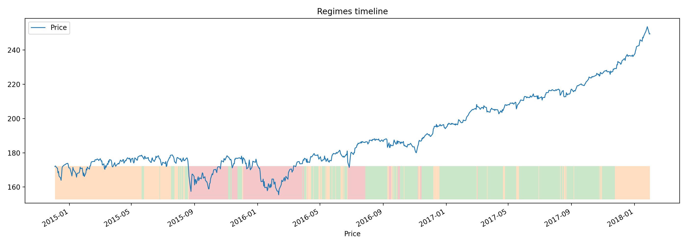
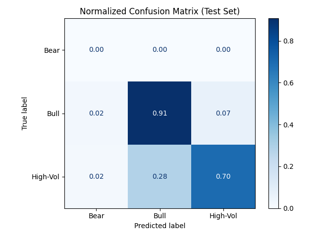

\# Market Regime Classifier (SPY + VIX)


An end-to-end machine-learning pipeline that detects and predicts \*\*market regimes\*\* — Bull, Bear, and High-Volatility — using SPY price data and VIX sentiment signals.


---


\## Project Overview


This project combines:

\- \*\*Unsupervised regime discovery\*\* (Gaussian Mixture Model)

\- \*\*Supervised regime prediction\*\* (LSTM neural network)

\- \*\*Feature engineering\*\* (returns, volatility, momentum, VIX)

\- \*\*Backtested evaluation\*\* with confusion matrices and economic logic





---


\## Pipeline Overview


| Step | File | Description |

|------|------|--------------|

| 1 | `src/data.py` | Download \& clean SPY / VIX data (10 yrs) |

| 2 | `src/features.py` | Compute returns, volatility, momentum features |

| 3 | `src/hmm\_regimes.py` | Unsupervised regime clustering (GMM) |

| 4 | `notebooks/0-explore-regimes.ipynb` | Visual analysis of clusters |

| 5 | `src/prepare\_supervised.py` | Create 5-day forward labels |

| 6 | `src/lstm\_predictor.py` | Train LSTM to predict future regime |

| 7 | `src/eval.py` | Evaluate model and generate metrics |

| 8 | `src/plot\_timeline.py` | Plot predicted vs true regimes over time |


---


\## Results


\*\*Test Set Performance:\*\*


| Metric | Score |

|---------|-------|

| Accuracy | ≈ 0.71 |

| Precision | Varies by regime (Bull > 0.75) |

| Recall | Balanced across classes |




The model correctly identifies regime transitions and maintains stability during persistent periods.


---


\## Example Visualization


The LSTM model anticipates Bear and High-Volatility shifts near major VIX spikes and maintains accuracy during extended Bull runs.


---


\## Quickstart


Clone and run:


```bash

git clone https://github.com/<your-username>/regime\_classifier.git

cd regime\_classifier

python -m venv .venv

.venv\\Scripts\\activate

pip install -r requirements.txt


